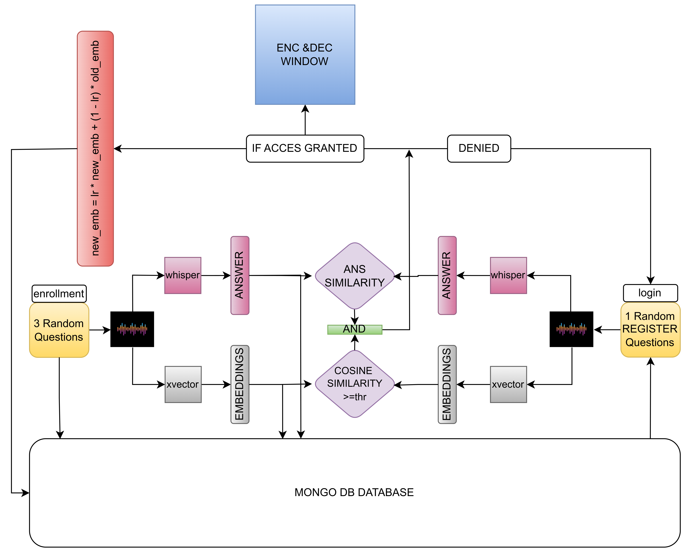

# 🎤🔒 Audio Vault ENC/DEC - Secure Speaker Verification System

## 🌟 Overview
**Audio Vault ENC/DEC** is a secure, two-step authentication system that combines **speaker verification** and **audio-based encryption/decryption** to ensure robust user authentication and data security. This project uniquely integrates voice authentication with secure data handling for both **user enrollment** and **data access**.
---

---

## 🚀 Features
- **🔑 Two-Step Verification**:
  - Enroll by answering questions via voice.
  - Authenticate by answering a randomly selected question; both voice and textual answers are verified.
  
- **🔐 Audio-Based Encryption and Decryption**:
  - Files are encrypted with an embedded answer.
  - During decryption, the embedded answer is validated for authentication.

- **🎲 Dynamic Authentication**:
  - Random questions ensure enhanced security.
  - All answers are securely stored in encrypted format.

---

## 🔄 Workflow

### 📝 1. User Enrollment
- Register by speaking answers to predefined questions.
- Both:
  - **Voice embeddings** (generated from audio).
  - **Text answers**.
- are securely stored in the database.

### 🔓 2. User Login
- A random question is presented for authentication.
- The system verifies:
  - New **voice embeddings**.
  - The **text answer**.

### 🔒 3. Data Encryption
- Encrypt files with an answer embedded in the encrypted file.
- The embedded answer ensures only the user can decrypt the file.

### 🗂️ 4. Data Decryption
- During decryption:
  - Extract the embedded answer.
  - Validate it against the database.
  - If verified, decrypt the file.

---

## 🗂️ Project Structure

<!-- ```plaintext
Audio_vault_ENC_DEC/
│
├── APP/                      # Application resources
│   ├── static/               # Static files (CSS, JS, images)
│   └── templates/            # HTML templates
│
├── Database/                 # Database configurations and files
│   └── audio_vault.db        # SQLite database file
│
├── Flask_APP/                # Web application (Flask framework)
│   ├── __init__.py           # Flask app initialization
│   ├── routes.py             # Application routes
│   └── models.py             # Database models
│
├── Audio_vault.py            # Core script for audio vault functionality
├── Audio_vault_uni.py        # Unified/alternative script
├── audio_vault1.py           # Another version of the main script
├── fetch_data.py             # Script to fetch user data
├── requirements.txt          # General project dependencies
├── requirements_audio_vault.txt  # Audio-specific dependencies
├── setup.sh                  # Setup script for initializing the environment
├── test.py                   # Testing script
├── AUDIO_VAULT.drawio.png    # Architecture/workflow diagram
└── README.md                 # Project documentation (this file)
``` -->
```plaintext
/home/girish/GIT/Audio_vault/Flask_APP
├── requirements.txt
├── app.py
├── test.py               
├── C++/
│   ├── dec
│   ├── enc
│   ├── dec_txt.c++
│   ├── enc_txt.c++
├── templates/
│   ├── index.html
│   ├── login.html
│   ├── enroll.html
│   ├── decrypt.html
│   ├── verify.html
│   ├── complete.html
│   ├── encrypt.html
│   ├── secure_dashboard.html
├── static/
│   ├── scripts.js
```
---

## ⚙️ Installation

### 📋 Prerequisites
- Python 3.8+
- Flask
- Audio processing libraries (e.g., PyTorch, Librosa)
- Database system (MongoDb)
- `pip` for dependency installation

### 🛠️ Setup
1. Clone the repository:
   ```bash
   git clone https://github.com/gir-ish/Audio_vault_ENC_DEC.git
   cd Audio_vault_ENC_DEC
   ```

2. Install dependencies:
   ```bash
   pip install -r requirements.txt
   ```

3. Configure the database:
   - Set up the database schema and connection in the `Database` directory.

4. Run the application:
   ```bash
   python Flask_APP/app.py
   ```

---

## 📖 Usage

### 📝 Enrollment
1. Navigate to the **enrollment page**.
2. Provide answers to questions. Your:
   - **Voice embeddings**
   - **Text answers**
   will be securely stored.

### 🔓 Login
1. Access the **login page**.
2. Answer a randomly selected question. The system validates:
   - Voice embeddings.
   - Textual answer.

3. On success, access encryption and decryption features.

### 🔒 Encryption
1. Select a file to encrypt.
2. Provide a textual answer linked to your enrollment.
3. The file will be encrypted with the answer embedded.

### 🔓 Decryption
1. Select an encrypted file.
2. The system extracts the embedded answer and validates it.
3. On success, the file is decrypted.

---

## 🎯 Future Improvements
- Multi-language audio processing support.
- Enhanced UI/UX for seamless user experience.
- Optimization of voice embedding algorithms for higher accuracy.
- Use of LLMs to get the one work answer user will have freedom speak complete sentence.
---
<!-- 
## 🤝 Contributing
1. Fork the repository.
2. Create a new branch for your changes.
3. Submit a pull request with a detailed explanation. -->

<!-- --- -->

---

Feel free to reach out or contribute to this secure system! 🎤🔒
