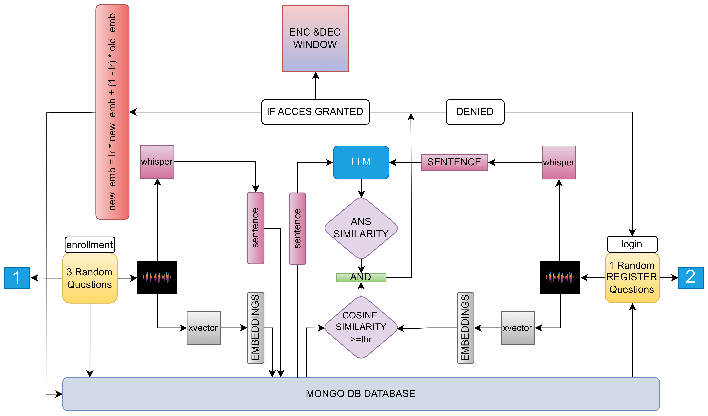

# 🎤🔒 Audio Vault ENC/DEC - Secure Speaker Verification System

## 🌟 Overview
**Audio Vault ENC/DEC** is a robust authentication framework that combines **speaker verification**, **voice embeddings**, and **AI-driven answer similarity** to ensure secure and dynamic authentication. This system integrates advanced technologies such as **Whisper** for speech-to-text, **LLMs (e.g., T5, LLaMA)** for semantic understanding, and **MongoDB** for secure data storage. It provides seamless workflows for enrollment, login, and data encryption/decryption, offering a unique blend of voice and text-based security.

---

---

## 🚀 Features

- **🔑 Two-Step Authentication**:
  - Combines **voice-based verification** with **semantic text matching**.
  - Uses both **voice embeddings** and **AI text understanding** for authentication.

- **🔐 Audio-Based Encryption and Decryption**:
  - Encrypts files with user-specific answers embedded as keys.
  - Validates embedded answers during decryption for secure access.

- **🎲 Randomized Questions**:
  - Dynamically selects random questions for authentication.
  - Ensures increased security through unpredictability.

- **🤖 LLM-Powered Answer Validation**:
  - Processes and validates **contextual answers** using a language model.
  - Supports flexible answers by focusing on semantic similarity.

- **📊 MongoDB Database**:
  - Securely stores voice embeddings and textual answers for rapid verification.

---


## 🔄 Workflow

### 1. **User Enrollment**:

1. User answers **three randomly selected questions** via voice.
2. System processes inputs using:
   - **Whisper** for speech-to-text conversion.
   - **X-Vectors** for voice embeddings.
3. Stores both:
   - Voice embeddings for speaker verification.
   - Text responses for semantic validation.
4. Data is securely saved in a MongoDB database.

---

### 2. **Login (Authentication)**:

1. User answers a **randomly selected question** from their enrollment data.
2. System verifies the input through:
   - **Voice Embedding Similarity**: Compares the user's current voice to their stored embeddings using cosine similarity.
   - **Textual Answer Validation**: Checks the semantic similarity between the user's response and the stored answer using LLMs.
3. Access is granted only if both checks pass.

---

### 3. **Encryption**:

1. User selects a file to encrypt.
2. User provides a specific answer, which is embedded as the encryption key.
3. The encrypted file ensures that only the user with the correct answer can decrypt it.

---

### 4. **Decryption**:

1. User uploads the encrypted file for decryption.
2. System extracts the embedded answer and validates it against the database.
3. If the validation is successful:
   - File is decrypted.
   - User gains access to the original content.

---

## 🗂️ Project Structure

<!-- ```plaintext
Audio_vault_ENC_DEC/
│
├── APP/                      # Application resources
│   ├── static/               # Static files (CSS, JS, images)
│   └── templates/            # HTML templates
│
├── Database/                 # Database configurations and files
│   └── audio_vault.db        # SQLite database file
│
├── Flask_APP/                # Web application (Flask framework)
│   ├── __init__.py           # Flask app initialization
│   ├── routes.py             # Application routes
│   └── models.py             # Database models
│
├── Audio_vault.py            # Core script for audio vault functionality
├── Audio_vault_uni.py        # Unified/alternative script
├── audio_vault1.py           # Another version of the main script
├── fetch_data.py             # Script to fetch user data
├── requirements.txt          # General project dependencies
├── requirements_audio_vault.txt  # Audio-specific dependencies
├── setup.sh                  # Setup script for initializing the environment
├── test.py                   # Testing script
├── AUDIO_VAULT.drawio.png    # Architecture/workflow diagram
└── README.md                 # Project documentation (this file)
``` -->
```plaintext
/home/girish/GIT/Audio_vault/Flask_APP
├── requirements.txt
├── app.py
├── test.py               
├── C++/
│   ├── dec
│   ├── enc
│   ├── dec_txt.c++
│   ├── enc_txt.c++
├── templates/
│   ├── index.html
│   ├── login.html
│   ├── enroll.html
│   ├── decrypt.html
│   ├── verify.html
│   ├── complete.html
│   ├── encrypt.html
│   ├── secure_dashboard.html
├── static/
│   ├── scripts.js
```
---

## ⚙️ Installation

### 📋 Prerequisites
- Python 3.8+
- Flask
- Audio processing libraries (e.g., PyTorch, Librosa)
- Database system (MongoDb)
- `pip` for dependency installation

### 🛠️ Setup
1. Clone the repository:
   ```bash
   git clone https://github.com/gir-ish/Audio_vault_ENC_DEC.git
   cd Audio_vault_ENC_DEC
   ```

2. Install dependencies:
   ```bash
   pip install -r requirements.txt
   ```

3. Configure the database:
   - Set up the database schema and connection in the `Database` directory.

4. Run the application:
   ```bash
   python Flask_APP/app.py
   ```

---

## 📖 Usage

### 📝 Enrollment
1. Navigate to the **enrollment page**.
2. Provide answers to questions. Your:
   - **Voice embeddings**
   - **Text answers**
   will be securely stored.

### 🔓 Login
1. Access the **login page**.
2. Answer a randomly selected question. The system validates:
   - Voice embeddings.
   - Textual answer.

3. On success, access encryption and decryption features.

### 🔒 Encryption
1. Select a file to encrypt.
2. Provide a textual answer linked to your enrollment.
3. The file will be encrypted with the answer embedded.

### 🔓 Decryption
1. Select an encrypted file.
2. The system extracts the embedded answer and validates it.
3. On success, the file is decrypted.

---

## 🎯 Future Improvements
- Multi-language audio processing support.
- Enhanced UI/UX for seamless user experience.
- Optimization of voice embedding algorithms for higher accuracy.
- Dynamic Thrusholds
---
<!-- 
## 🤝 Contributing
1. Fork the repository.
2. Create a new branch for your changes.
3. Submit a pull request with a detailed explanation. -->

<!-- --- -->

---

Feel free to reach out or contribute to this secure system! 🎤🔒
